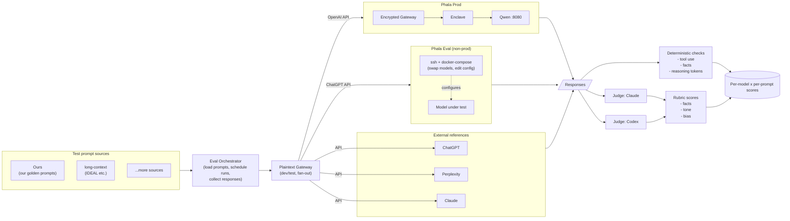

# Eval Framework

Run a fixed set of test prompts against our model (in Phala Prod), against the same model running on a configurable Phala-Eval instance, and against external reference models. Score every response with deterministic checks and an LLM-judge rubric.

## Test prompt sources

Each source is a bucket of prompts the harness pulls from. The list is open-ended; more sources will be added.

- **Ours** - our own prompt expectations (golden set we curate)
- **long-context** - IDEAL-style external long-context benchmark
- (more to come)

Test domains the prompts cover: long context, current facts, data analysis, market data (stocks), planning (holidays), research (lots, shopping). Cooking was dropped.

## Systems under test

- **Phala Prod** - production deployment: encrypted gateway -> enclave -> Qwen, called via its OpenAI-compatible endpoint on :8080.
- **Phala Eval** - second Phala instance, **not** production. SSH + docker-compose access so we can swap models and edit configs by hand for each eval run. Called via the same ChatGPT/OpenAI-compatible API surface.
- **External references** - ChatGPT, Perplexity, Claude, called via their public APIs.

## Eval harness

- **Eval orchestrator** - sits between the prompt sources and the gateway. Loads prompts from each source, schedules the run matrix (prompt x system under test), records responses, and hands them off to the scoring pipeline.
- **Plaintext Gateway** - our dev/test gateway. Receives prompts from the orchestrator, fans them out to every system under test, returns responses. Plaintext sibling of the encrypted prod gateway.

## Scoring

Two independent passes over each response.

- **Deterministic checks**: tool use, facts (exact-match / structured), reasoning-token counts.
- **Rubric (LLM judge)**: facts, tone, bias. Both **Claude** and **Codex** run as judges (second judge cross-checks the first).

## Mermaid



## ASCII

```
                  TEST PROMPT SOURCES
        +---------+  +--------------+  +-----+
        |  Ours   |  | long-context |  | ... |
        +----+----+  +------+-------+  +--+--+
             |              |             |
             +--------------+-------------+
                            |
                            v
                  +---------------------+
                  | Eval Orchestrator   |   load prompts,
                  | (run matrix, log    |   schedule runs,
                  |  responses)         |   collect responses
                  +----------+----------+
                             |
                             v
                  +---------------------+
                  |  Plaintext Gateway  |   dev/test fan-out
                  +----------+----------+
                             |
   +------------+------------+------------+------------+------------+
   |            |            |            |            |            |
   v            v            v            v            v            v
+--------+ +----------+ +---------+ +-----------+ +-----------+ +--------+
| Phala  | | Phala    | | ChatGPT | | Perplexity| | Claude    | |  ...   |
| Prod   | | Eval     | |  API    | |  API      | |  API      | |        |
|--------| |----------| +---------+ +-----------+ +-----------+ +--------+
| enc-gw | | ssh +    |
|   |    | | compose  |     (external reference models)
|   v    | |   |      |
| enclave| |   v      |
|   |    | | model    |
|   v    | | under    |
| qwen   | | test     |
| :8080  | |          |
+---+----+ +----+-----+
    |           |
    +-----+-----+----- responses ----+----+----+
                                     |    |    |
                                     v    v    v
                              (all responses merged)
                                     |
                +--------------------+--------------------+
                |                                         |
                v                                         v
      +-------------------+              +----------------------------+
      | Deterministic     |              |  LLM Judges                |
      | - tool use        |              |   - Claude                 |
      | - facts           |              |   - Codex                  |
      | - reasoning toks  |              |                            |
      +---------+---------+              |  Rubric:                   |
                |                        |   - facts                  |
                |                        |   - tone                   |
                |                        |   - bias                   |
                |                        +-------------+--------------+
                |                                      |
                +--------------------+-----------------+
                                     v
                          +---------------------+
                          |   Scores            |
                          |  per model x prompt |
                          +---------------------+
```
